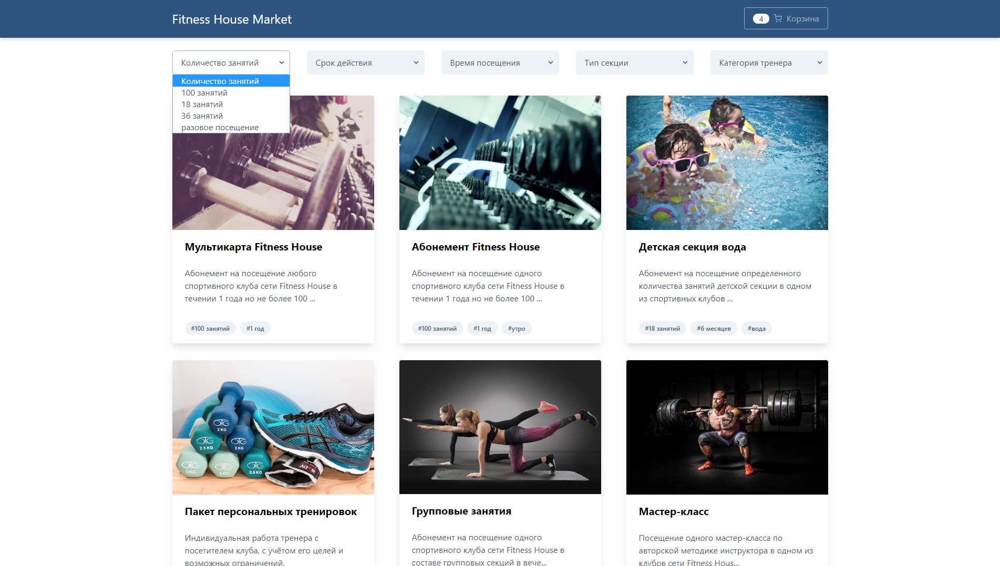
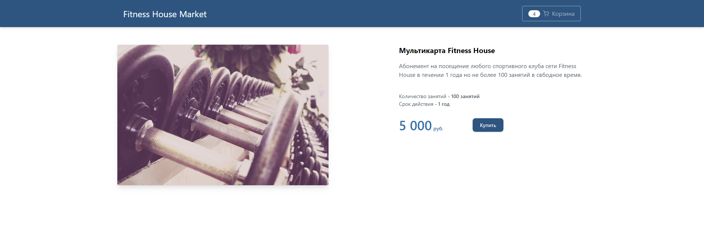

# Тестовое задание на позицию Frontend Developer в компанию Fitness House
#### Город: Санкт-Петербург
#### Дата вакансии: 21.02.2020

#### Задача:

#### Опыт соискателя
* Знание JavaScript(ES6+), HTML5, CSS3;
* Опыт разработки клиентских приложений на React.js, Vue.js;
* Опыт работы с одним из препроцессоров PostCSS/Less/Sass/Stylus;
* Опыт разработки адаптивных и кроссбраузерных приложений;

#### Задание
Создать простое [SPA приложение](https://ru.wikipedia.org/wiki/%D0%9E%D0%B4%D0%BD%D0%BE%D1%81%D1%82%D1%80%D0%B0%D0%BD%D0%B8%D1%87%D0%BD%D0%BE%D0%B5_%D0%BF%D1%80%D0%B8%D0%BB%D0%BE%D0%B6%D0%B5%D0%BD%D0%B8%D0%B5)
из двух страниц, используя JavaScript, HTML, CSS.

#### Стартовая страница
Стартовая страница - список услуг сети клубов Fitness House

с возможностью фильтрации по свойствам услуг.

* Данные подгружаются с помощью AJAX. Тестовые данные находятся в файле [public/data/service.json](./public/data/services.json).
* Фильтры в виде выпадающих списков.
* Фильтрация услуг происходит по всем имеющимся свойствам и их значениям в списке услуг.
* Описание услуги в списке не должно превышать 100 символов.
* Изображение - ссылка на страницу услуги.

#### Страница услуги

* На страницу услуги можно попасть либо со страницы списка услуг, кликнув на изображение в списке услуг, либо по прямой ссылке вида: "http://you_domain/service/service_alias"
* Описание услуги полное.
* Цена услуги имеет формат целого числа разделенного пробелом.
* Кнопка "Купить" добавляет в "корзину" приобретенную услугу (здесь обычный счетчик).

#### Header
* При прокрутке страницы всегда находится в верху страницы.
* Заголовок - ссылка на стартовую страницу приложения
* Корзина - количество услуг добавленных на странице услуги. Количество "купленных" услуг не должно сбрасываться при переходе на стартовую страницу и обратно, при выборе другой услуги.

#### Макет
* Макет адаптивный. Breakpoints - '640px', '768px', '1024px', '1280px'.

#### Требования
* Результат выложить на GitHub.
* README.md файл с инструкцией о загрузке, развертывании, компиляции (и т.д.) приложения.

#### Плюсом будет
* Покрытие проекта тестом.
* Развертывание рабочего приложения на GitHub-pages или Heroku

#### Ссылки:
- <a target="_blank" href="https://github.com/fhcs/test-task-web">Ссылка на Задание GitHub
</a>
